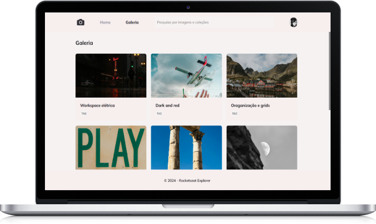

# Fotoblog
Projeto de galeria de fotos feito para estudo do css.

### Para acessar o projeto [clique aqui!](https://queziafiladelfo.github.io/fotoblog/)

  

**Tópicos estudados**:
- Unidade de medida flexível
- Grid
- Variáveis no CSS
- Cores
- Animações simples

Feito com 💜 por Quézia 

